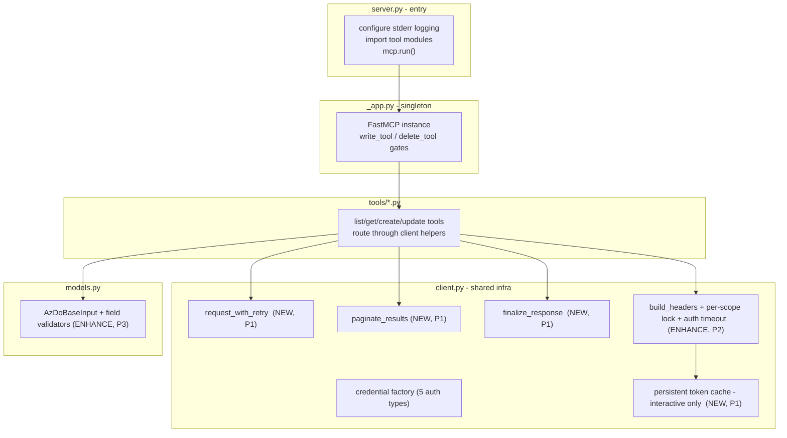

# Design: Aligning devops-mcp with dataverse-mcp Architecture

- Status: Draft · Date: 2026-06-19 · Related: sibling repo `dataverse-mcp` (v2.2.0)
- Audience: maintainer (Ryan James) — a decision-ready proposal, not an implementation.

> This is a **design-only** document. It proposes target architecture and a phased plan.
> No source, config, CI, or `CLAUDE.md` changes are made by this document. Every code
> change described here is a *recommendation* for a later build pass.

---

## 1. Executive summary

`devops-mcp` (v0.1.0, Alpha, 23 tools) and `dataverse-mcp` (v2.2.0, Beta, 118 tools) are
sibling MCP servers built on the identical skeleton: `server.py` entry → `_app.py` singleton
`FastMCP` → `client.py` (auth/HTTP/lifespan) → `models.py` (Pydantic v2) → `tools/` domain
modules. They already share the most important conventions: stderr-only logging, env-driven
config, JSON-string tool returns, truthful tool annotations, `{Action}{Resource}Input` models
with `ConfigDict(str_strip_whitespace=True, extra="forbid")`, the ordered
`HTTPStatusError → Exception` error contract, `count`/`has_more` on lists, and — already — the
**`write_tool`/`delete_tool` env-gated decorator pattern** (`AZDO_ALLOW_WRITE`/`AZDO_ALLOW_DELETE`).

dataverse-mcp is roughly two maturity tiers ahead in four areas: **resilience** (retry with
idempotency gating, response-size cap, a shared pagination helper), **auth UX** (persistent token
cache, per-scope lock, configurable auth timeout), **quality gates** (pytest + ruff + CI/release
workflows), and **operator docs** (README config table, CHANGELOG, design docs). Crucially,
dataverse-mcp reached that maturity *incrementally* — ruff was adopted with `select=["I"]` and
`src/**` deferred via per-file-ignores, and tests were added behind an `integration` marker — not
via a big-bang rewrite.

**Recommendation:** raise devops-mcp toward that maturity in four ordered phases, mirroring
dataverse-mcp's own incremental adoption, and translating *principles* (not OData implementations)
where the two services diverge. The top early wins, in order:

1. **Phase 0 — quality-gate scaffolding** (ruff imports-only + pytest harness + a minimal CI smoke job). Low risk, unblocks safe verification of everything after it.
2. **Phase 1 — resilience**: a `request_with_retry` helper with **idempotency gating**, a `finalize_response` size cap, and a **shared pagination helper** that unifies the three divergent list styles in devops-mcp today.
3. **Phase 2 — auth UX**: persistent token cache for the `interactive` auth path only, plus the per-scope lock + configurable auth timeout.
4. **Phase 3/4 — hardening & docs**: input validators, the README config table, a CHANGELOG, and fixing two confirmed drift items.

Two **correctness items** surfaced during analysis and are folded into the plan (not the
architecture): (a) the `AZDO_LOG_LEVEL` default disagreement between `CLAUDE.md` and the code, and
(b) `devops_create_pull_request` sets `workItemRefs`, which the same file's own
`devops_link_work_items_to_pull_request` docstring and `CLAUDE.md` say Azure DevOps does not honor.

---

## 2. dataverse-mcp architecture & guiding principles (the "why")

The value of dataverse-mcp is less in any single function than in six principles it applies
consistently. These are what we want devops-mcp to inherit; the implementations differ because
Azure DevOps is a REST API, not OData.

| Principle | What it means | Where it lives in dataverse-mcp |
| --- | --- | --- |
| **Operator control / safe-by-default** | Destructive capability is opt-in; the server is read-only until an operator flips an env flag. | `write_tool`/`delete_tool` gated on `DATAVERSE_ALLOW_WRITE`/`DATAVERSE_ALLOW_DELETE` (`_app.py`) |
| **Resilience** | Transient failures (throttling, gateway 5xx) are absorbed, but never at the cost of duplicating a write. | `request_with_retry` with `_IDEMPOTENT_METHODS` gating (`client.py:655`) |
| **Bounded blast radius** | A single call can neither flood the client nor exhaust memory. | `finalize_response` 5 MB cap / 1 MB warn (`client.py:850`); `paginate_records` with `_MAX_PAGE_SIZE=500` (`client.py:728`) |
| **Observability** | All diagnostics to stderr; redirects and oversized responses are logged; stdout stays clean for stdio transport. | logging throughout `client.py`; warn logs in `finalize_response` |
| **Convention over configuration** | Every tool follows one naming/return/error shape, so 118 tools stay uniform. | `tool_error_response` helper centralizes the except-chain (`client.py:800`) |
| **Incremental quality gates** | New rules enforced on *new* code first; legacy `src/` exempted to avoid a stop-the-world refactor. | `ruff select=["I"]` + `per-file-ignores "src/**" = ["I001"]` (`pyproject.toml:67`) |

The non-negotiable invariant both servers share — **stdout is reserved for MCP stdio transport,
logging to stderr only** — is already honored identically in devops-mcp (`server.py:9-13`
streams to `sys.stderr`).

---

## 3. Current devops-mcp state

### Already aligned (do **not** re-do)

- **Skeleton & module split** identical to dataverse-mcp (`server.py`/`_app.py`/`client.py`/`models.py`/`tools/`).
- **Write/delete gating** — `write_tool`/`delete_tool` on `AZDO_ALLOW_WRITE`/`AZDO_ALLOW_DELETE` (`_app.py:27-40`); already applied to all 6 PR write tools (`pull_requests.py`). This alignment is **done**.
- **Pydantic conventions** — `AzDoBaseInput` with `ConfigDict(str_strip_whitespace=True, extra="forbid")` and `Field(...)` on every field (`models.py:6-24`); `{Action}{Resource}Input` naming throughout.
- **Error contract** — every tool catches `ValueError → httpx.HTTPStatusError → Exception` in that order, returns `{"error": True, "message": ...}`, and never lets exceptions escape (e.g. `pipelines.py:81-89`).
- **List shape** — `count` + `has_more` on every list tool; `continuation_token` echoed where Azure returns `x-ms-continuationtoken` (`pipelines.py:69-79`).
- **Observability** — stderr-only logging, no `print()`, debug request/response hooks incl. redirect warnings (`client.py:187-205`).
- **Truthful annotations** — `readOnlyHint`/`destructiveHint`/`idempotentHint`/`openWorldHint` set per tool.
- **Auth breadth** — devops-mcp supports **5** auth types (`default`, `azure_cli`, `interactive`, `client_secret`, `managed_identity`; `client.py:151-184`) vs dataverse-mcp's 2. devops-mcp is *ahead* here; alignment must not narrow it.
- **Partial thread-offload** — `build_headers` already runs token acquisition via `asyncio.to_thread` on cache miss (`client.py:93`).

### Missing vs dataverse-mcp

- No `tests/` at all; no `.github/workflows/` (no CI, no release automation); no ruff/linter/formatter/type-checker config; no `CHANGELOG.md`.
- No `request_with_retry` — transient 429/502/503/504 fail on first hit.
- No response-size cap — a large log or PR list can flood the client.
- No **shared pagination helper** — three different list strategies coexist (see §4).
- Token cache is **in-memory only** (`AppContext._token_cache`, `client.py:50`) — `interactive` auth re-prompts on every server restart.
- No per-scope `asyncio.Lock` (concurrent cold-cache calls each acquire a token), no configurable auth timeout, no re-check-after-lock.

### Confirmed drift / correctness items (verified in code)

- **(a) Log-level default disagreement.** `CLAUDE.md` env table says `AZDO_LOG_LEVEL` defaults to `DEBUG`; `server.py:8` reads it with default `"INFO"` (and an unreachable `logging.DEBUG` fallback for invalid values). Actual default is **INFO**. One of the two must change; this doc recommends fixing the doc, not the behavior (§6, Phase 4).
- **(b) PR work-item link contradiction.** `devops_create_pull_request` sets `body["workItemRefs"] = [...]` (`pull_requests.py:209-210`), but the **same file's** `devops_link_work_items_to_pull_request` docstring states *"Azure DevOps does not support updating workItemRefs via the pull request PATCH API"* (`pull_requests.py:388-390`) and links via the work-item `ArtifactLink` relation instead (`pull_requests.py:456-466`). `CLAUDE.md` codifies the ArtifactLink rule. The create-path `workItemRefs` is therefore likely a silent no-op for linking. This is a **correctness bug**, tracked in Phase 4; it is out of scope for the architecture proposal itself.

---

## 4. Gap analysis

`Adopt?` legend: **Y** = adopt the pattern; **Adapt** = adopt the principle, different implementation;
**N** = do not copy. Priority: **P0** foundational, **P1** high-value, **P2** nice-to-have.

| # | Dimension | dataverse-mcp | devops-mcp today | Adopt? | Pri | Notes / citations |
| --- | --- | --- | --- | --- | --- | --- |
| 1 | Write/delete gating | `write_tool`/`delete_tool` env flags | **Same, present** | — | — | `_app.py:27-40`. **Already aligned — do not re-do.** |
| 2 | Lint / format | `ruff` `select=["I"]`, `src/**` deferred | none | **Adapt** | P0 | Adopt incrementally exactly as dataverse did (`pyproject.toml:67-85`). |
| 3 | Unit tests | `pytest` + `pytest-asyncio` `asyncio_mode="auto"` | none | **Y** | P0 | Mirror `[tool.pytest.ini_options]` (`pyproject.toml:61-65`). |
| 4 | Integration tests | `@pytest.mark.integration`, skip when env unset | none | **Y** | P1 | `tests/integration/` + `conftest.py` fixtures. |
| 5 | CI workflow | `ci.yml` smoke import + pytest + ruff | none | **Adapt** | P0 | Drop the C# sample build step (dataverse-specific). |
| 6 | Release automation | `release.yml` → PyPI | none | **Y/defer** | P2 | **Open question §8** — Alpha may not want PyPI yet. |
| 7 | Retry / throttling | `request_with_retry`, idempotency-gated | none | **Adapt** | P1 | Same status codes (429/502/503/504) + `_IDEMPOTENT_METHODS` gate (`client.py:655-725`). REST, not OData — port the logic verbatim; it is transport-agnostic. |
| 8 | Response-size cap | `finalize_response` 5 MB / 1 MB warn | none | **Adapt** | P1 | Port directly; **revisit the 5 MB value** for pipeline-log payloads (§7). |
| 9 | Shared pagination | `paginate_records` via `@odata.nextLink` | 3 divergent styles | **Adapt** | P1 | Azure DevOps uses `$top`/`$skip` + `x-ms-continuationtoken`, **not** `@odata.nextLink`. Build an Azure-DevOps-shaped helper; do not copy the OData one. Brain: `Dataverse MCP Conformant List Paging Pattern.md`. |
| 10 | Persistent token cache | `TokenCachePersistenceOptions` + `AuthenticationRecord` sidecar | in-memory only | **Adapt** | P1 | Applies to the **`interactive`** path only (one of 5 auth types). Brain: `azure-identity Persistent Token Cache.md`. |
| 11 | Per-scope token lock | `_token_locks: dict[str, asyncio.Lock]` + re-check | none (thread-offload only) | **Y** | P2 | devops-mcp uses a single fixed scope, so contention is lower; still cheap correctness (`client.py:604-630`). |
| 12 | Configurable auth timeout | `DATAVERSE_AUTH_TIMEOUT_SECONDS` (default 30) | none | **Y** | P2 | `AZDO_AUTH_TIMEOUT_SECONDS`; defensive parse like `_get_auth_timeout_seconds` (`client.py:136-162`). |
| 13 | URL allowlist | `DATAVERSE_WHITELIST` (IDNA canonical) | none | **N / Open** | P2 | dataverse mints tokens for *caller-supplied* hostnames → allowlist is essential. devops-mcp is **fixed-host** `https://dev.azure.com/...` (`client.py:139-141`); host is not user-controlled, so the threat largely does not exist. **Open question §8.** |
| 14 | XXE / `defusedxml` | `defusedxml` for OData XML | none | **N/A** | — | devops-mcp parses **no** untrusted XML (all `response.json()`); not applicable. |
| 15 | OData `$batch` | `batch.py` multipart | n/a | **N** | — | Azure DevOps has no `$batch` equivalent in scope; do not introduce. |
| 16 | `odata_quote` | OData literal escaping | n/a | **N** | — | No OData filter literals; WIQL would need its own escaping if added later. |
| 17 | Centralized error helper | `tool_error_response(e, name)` | inline per-tool except blocks | **Adapt** | P2 | Optional DRY-up; the inline blocks already match the contract. Low priority. |
| 18 | README config table | full env-var table, auth, security | minimal README | **Y** | P1 | Mirror dataverse README structure. |
| 19 | CHANGELOG | Keep-a-Changelog + SemVer | none | **Y** | P2 | Add with an `Unreleased` section. |
| 20 | Design docs | `docs/design/*.md` | **this file** | **Y** | — | Precedent: `dataverse-mcp/docs/design/interactive-token-cache-persistence.md`. |
| 21 | Type checking (mypy) | **absent in dataverse too** | absent | **N / Open** | P2 | Neither repo type-checks. **Open question §8** — adopt or stay consistent. |

---

## 5. Proposed target architecture for devops-mcp

The target is dataverse-mcp's shape, projected onto the Azure DevOps REST transport, with **every
`CLAUDE.md` invariant preserved**. No module is added or split; capabilities land in the existing
files. The diagram shows where each new capability sits.

**Where each capability lands (and the invariant it must honor):**

- **`client.py` — resilience core (Phase 1).**
  - `request_with_retry(http_client, method, url, ...)` ported from dataverse-mcp `client.py:655`. Same `_RETRYABLE_STATUS_CODES = (429, 502, 503, 504)`, same `_IDEMPOTENT_METHODS = {GET, PUT, DELETE}` gating so PR `create`/`update` (POST/PATCH) are **never auto-retried** on 5xx. Honors `Retry-After` (cap 30 s) for 429 on all methods. This is transport-agnostic and copies cleanly.
  - `finalize_response(payload, *, max_bytes)` ported from `client.py:850`. Tools return `finalize_response({...})` instead of `json.dumps({...})`. Honors invariant #3 (JSON string out) and adds the bounded-blast-radius property. **Note** the cap value (§7).
  - `paginate_results(...)` — an **Azure-DevOps-shaped** helper, *not* the OData one. It loops on the `x-ms-continuationtoken` response header (Continuation-Token pattern already used by `devops_list_pipelines`, `pipelines.py:69`) until a bounded `top` is collected, returning records + a `has_more` heuristic. This unifies the three styles in §4 #9. Honors invariant #6 (`count` on lists) and the brain paging pattern's `count`/`has_more` contract.

- **`client.py` — auth UX (Phase 2).**
  - Persistent token cache wired into the **`interactive`** branch of `_build_credential` only (`client.py:158`). Add `TokenCachePersistenceOptions(name="devops-mcp.cache", ...)` + an `AuthenticationRecord` sidecar under a per-user config dir, gated by `AZDO_TOKEN_CACHE_PERSIST` (mirror dataverse's `_build_credential`, `client.py:358-450`). The other four auth types (`default`, `azure_cli`, `client_secret`, `managed_identity`) are untouched — they don't prompt in-process. **The one-shot `get_token` wrapper MUST restore the original method before calling `authenticate()`** or it recurses unbounded (brain note gotcha).
  - Per-scope `_token_locks: dict[str, asyncio.Lock]` on `AppContext` + re-check-after-lock in `build_headers` (mirror `client.py:604-630`). devops-mcp's `build_headers` already offloads to a thread (`client.py:93`); this adds the lock + re-check around it.
  - `AZDO_AUTH_TIMEOUT_SECONDS` (default 30) wrapping the `to_thread` call in `asyncio.wait_for`, raising `ClientAuthenticationError` on timeout. Defensive parse like `_get_auth_timeout_seconds` (`client.py:136-162`).

- **`models.py` — input safety (Phase 3, light).** Add `@field_validator` for any GUID-shaped fields (e.g. reviewer/identity IDs in `CreatePullRequestInput`) and bounded `top` defaults on list inputs so pagination is always bounded (today several `top` fields are `default=None`, e.g. `ListPipelinesInput.top`, `models.py:35`). Keep `extra="forbid"` and `Field(...)` everywhere (invariants #5).

- **`_app.py` / `server.py` — unchanged structurally.** Gating already present; logging already stderr-only. The only `server.py` touch is the Phase 4 doc/behavior reconciliation for `AZDO_LOG_LEVEL`.

- **`tools/*.py` — mechanical refactor only.** Each tool swaps direct `http_client.get/post` for `request_with_retry(...)` and `json.dumps({...})` for `finalize_response({...})`, and list tools call `paginate_results`. Naming (`devops_{verb}_{noun}`), return type (`str`), annotations, and the except-chain stay exactly as they are (invariants #1–#6). The Azure DevOps API-version conventions (v7.1 pipelines/repos, v7.2-preview PRs/work items; `pull_requests.py:30-31`) are preserved verbatim.

**Invariant compliance summary:** none of the proposed changes touches stdout (#1), introduces
hardcoded config (#2 — all new behavior is env-driven), changes return types to non-JSON (#3),
renames tools/models (#4/#5), weakens the error contract (#6), or alters API versions / the
ArtifactLink linking rule (#7 — in fact Phase 4 *fixes* a violation of #7).

---

## 6. Phased work plan

Each phase lists concrete steps, target files, ordering dependencies, rough effort (S ≤ 0.5 d /
M ≈ 1–2 d / L ≈ 3 d+), and how to verify. Phases are ordered so that the quality gate (Phase 0)
exists before the behavioral changes it verifies.

### Phase 0 — Quality-gate scaffolding (P0)

*Goal: a safety net before changing runtime behavior. Mirror dataverse-mcp's incremental adoption.*

| Step | Target file(s) | Effort | Verify |
| --- | --- | --- | --- |
| 0.1 Add `ruff` dev dep; `[tool.ruff]` `target-version="py310"`, `select=["I"]`; `per-file-ignores "src/**"=["I001"]` to defer the legacy import-order refactor | `pyproject.toml` `[dependency-groups].dev` + new `[tool.ruff]` | S | `uv run ruff check .` passes (src deferred). |
| 0.2 Add `pytest`, `pytest-asyncio`; `[tool.pytest.ini_options] asyncio_mode="auto"` + `integration` marker | `pyproject.toml` | S | `uv run pytest` collects 0 tests cleanly. |
| 0.3 Create `tests/` with one smoke test: import `devops_mcp.server` and assert the tool registry is non-empty | `tests/test_smoke.py` | S | `uv run pytest` green. |
| 0.4 Add `.github/workflows/ci.yml`: matrix py3.10–3.12, `uv sync`, ruff check, pytest. **No C# sample step** (dataverse-specific) | `.github/workflows/ci.yml` | M | CI green on a PR. |

Dependencies: none. **This is the prerequisite for verifying Phases 1–3.**

### Phase 1 — Resilience (P1)

*Goal: absorb transient failures and bound response size without risking duplicate writes.*

| Step | Target file(s) | Effort | Verify |
| --- | --- | --- | --- |
| 1.1 Port `request_with_retry` + retry constants (idempotency-gated) | `client.py` | M | Unit test: 429→retry honoring `Retry-After`; 503 on GET retries, on POST returns immediately (mirror `tests/test_request_with_retry.py`). |
| 1.2 Route all tool HTTP calls through `request_with_retry` | `tools/pipelines.py`, `repositories.py`, `pull_requests.py`, `work_items.py` | M | Existing behavior unchanged on 2xx; new retry on injected 429. |
| 1.3 Port `finalize_response` (size cap); replace `json.dumps({...})` returns in tools | `client.py` + all `tools/*.py` | M | Unit test: payload > cap returns `{"error": True, ...}`; under cap returns the JSON. |
| 1.4 Add Azure-DevOps `paginate_results` (continuation-token loop, bounded `top`); refactor the 3 list styles onto it | `client.py` + list tools in all 4 modules | L | Unit test with a 2-page mocked `x-ms-continuationtoken` sequence; `count`/`has_more` correct. |

Dependencies: Phase 0 (tests verify each step). 1.4 depends on 1.1 (paginator calls retry).
**Risk to watch:** 1.2/1.3 must not auto-retry POST/PATCH — see §7.

### Phase 2 — Auth UX (P1/P2)

*Goal: stop interactive re-prompts on restart; make cold-cache token acquisition safe & bounded.*

| Step | Target file(s) | Effort | Verify |
| --- | --- | --- | --- |
| 2.1 Persistent token cache for the **`interactive`** branch only: `TokenCachePersistenceOptions` + `AuthenticationRecord` sidecar, gated by `AZDO_TOKEN_CACHE_PERSIST` | `client.py` `_build_credential` | L | Unit test the one-shot wrapper: fake `authenticate()` calls `self.get_token`; assert `authenticate` + save each called once (no recursion — brain gotcha). |
| 2.2 Add per-scope `_token_locks` + re-check-after-lock around the existing `to_thread` call | `client.py` `AppContext` + `build_headers` | M | Unit test: N concurrent cold-cache `build_headers` → exactly one `get_token`. |
| 2.3 Add `AZDO_AUTH_TIMEOUT_SECONDS` (default 30) via `asyncio.wait_for`; defensive parse | `client.py` | S | Unit test: blocked credential → `ClientAuthenticationError` after timeout. |

Dependencies: Phase 0. 2.1 is independent of Phase 1. **Security caveats:** §7 + brain note.

### Phase 3 — Safety / hardening (P2/P3)

*Goal: input validation; allowlist only if §8 decides it's warranted.*

| Step | Target file(s) | Effort | Verify |
| --- | --- | --- | --- |
| 3.1 Add `@field_validator` for GUID-shaped IDs; give list `top` fields bounded defaults | `models.py` | M | Unit test: malformed GUID → `ValidationError` surfaced as `{"error": True}`. |
| 3.2 *(conditional on §8)* URL allowlist — only if multi-org / SSRF concern is real | `client.py` | M | Deferred pending decision; likely **N/A** (fixed host). |

Dependencies: Phase 0. Independent of Phases 1–2.

### Phase 4 — Docs & drift fixes (P1/P2)

*Goal: operator-facing docs + correctness reconciliation.*

| Step | Target file(s) | Effort | Verify |
| --- | --- | --- | --- |
| 4.1 **Fix log-level drift**: make `CLAUDE.md` say default `INFO` (matches `server.py:8`), or change code to DEBUG — pick one | `CLAUDE.md` *or* `server.py` | S | Doc and code agree; manual check. |
| 4.2 **Fix PR work-item link bug**: drop `workItemRefs` from `devops_create_pull_request` and link via the work-item `ArtifactLink` path (reuse `_build_pull_request_artifact_uri`), or document the limitation | `tools/pull_requests.py` | M | Integration test: created PR shows the work-item link. |
| 4.3 Expand README with full env-var config table, auth methods, security notes (mirror dataverse README) | `README.md` | M | Review. |
| 4.4 Add `CHANGELOG.md` (Keep-a-Changelog + SemVer, `Unreleased` section) | `CHANGELOG.md` | S | Review. |
| 4.5 *(if §8 says yes)* `release.yml` PyPI automation | `.github/workflows/release.yml` | M | Tag → dry-run publish. |

Dependencies: 4.2 benefits from Phase 0 (integration test). 4.1/4.3/4.4 independent.

> Phases 1, 2, 3, 4 are independent of each other after Phase 0 and can be sequenced by appetite.
> Recommended order by value: **0 → 1 → 4 (4.1/4.2 drift fixes) → 2 → 3**, pulling the two
> correctness fixes (4.1, 4.2) forward because they are cheap and address known wrong behavior.

---

## 7. Risks & trade-offs

- **Retry vs non-idempotent writes (highest risk).** A naive retry would double-create PRs or
  double-apply labels. The dataverse design already solves this: `_IDEMPOTENT_METHODS` gating
  returns 5xx immediately for POST/PATCH. The port **must keep that gate**; the PR `create`,
  `update`, `tag`, and `link` tools (`pull_requests.py`) and work-item writes are POST/PATCH.
  `devops_tag_pull_request` loops POSTs per label (`pull_requests.py:346-354`) — a mid-loop retry
  would be especially bad. Verification (step 1.1's test) is the guardrail.
- **Persistent token cache — platform & security.** Encryption-by-default fails fast on headless
  Linux without an OS secret store (brain note); a persisted refresh token is long-lived and
  high-value. Mitigations: gate behind `AZDO_TOKEN_CACHE_PERSIST`, require explicit opt-in for
  unencrypted storage, sidecar stored `0600`, and apply only to the `interactive` path. The
  one-shot-wrapper recursion bug is a real footgun — the brain note's regression test is mandatory.
- **Response-size cap value.** dataverse's 5 MB is tuned for record sets. Pipeline **log content**
  (`devops_get_run_log_content`, `pipelines.py:292`) can legitimately be large; a 5 MB cap might
  truncate useful logs. Trade-off: either raise the cap for the log tool, or rely on its existing
  `start_line`/`end_line` slicing and keep the cap. Recommend: keep one cap, document the slicing.
- **Scope creep vs Alpha status.** devops-mcp is v0.1.0 with 23 tools. Importing all of
  dataverse-mcp's machinery risks over-engineering an Alpha. Mitigation: the phasing — Phase 0/1
  pay off immediately; Phase 2/3 are deferrable; release automation (4.5) is explicitly optional.
- **Test-infra cost.** A test harness is new surface to maintain. Mitigation: start with unit
  tests for the high-risk helpers (retry gating, paginator, token wrapper) — exactly where
  dataverse-mcp concentrated its tests — not blanket coverage.
- **Incremental-lint debt.** `select=["I"]` + deferred `src/**` leaves real lint debt in `src/`.
  This is the deliberate dataverse trade-off (ship the gate now, refactor later) and is acceptable.

---

## 8. Open questions for the maintainer

1. **PyPI release automation now or later?** devops-mcp is Alpha (v0.1.0). Adopt `release.yml`
   (Phase 4.5) now, or defer until Beta? *(Recommendation: defer.)*
2. **URL allowlist — needed?** Azure DevOps is a **fixed host** (`https://dev.azure.com/{org}/...`,
   `client.py:139-141`); only `organization`/`project` path segments are user-supplied, not the
   host. dataverse's `DATAVERSE_WHITELIST` exists because the *hostname* is caller-supplied. Is a
   per-org allowlist (e.g. restrict which `AZDO_ORGANIZATION` values are permitted) worth it, or is
   fixed-host enough? *(Recommendation: skip the URL allowlist; consider an org allowlist only if
   multi-tenant exposure is a real concern.)*
3. **Ruff rule set — imports-only first, or broader?** dataverse went `select=["I"]` and deferred
   the rest. Match that, or adopt `E,W,F` from the start (larger initial refactor)?
   *(Recommendation: match dataverse — imports-only first.)*
4. **Persistent token cache — on by default (like dataverse) or opt-in?** dataverse defaults
   `DATAVERSE_TOKEN_CACHE_PERSIST=true`. Given devops-mcp's primary auth is likely `default`/
   `azure_cli` (which don't prompt in-process), is the `interactive` cache worth defaulting on, or
   opt-in via `AZDO_TOKEN_CACHE_PERSIST`? *(Recommendation: implement it, default on to match
   dataverse, but it only affects the `interactive` path.)*
5. **mypy / type checking?** **Neither** repo type-checks today. Adopt mypy in devops-mcp (diverging
   ahead of dataverse), or stay consistent and skip it? *(Recommendation: skip for now to keep the
   two repos consistent; revisit as a cross-repo decision.)*
6. **Drift fix direction for `AZDO_LOG_LEVEL` (§6, 4.1).** Code defaults to `INFO`; `CLAUDE.md` says
   `DEBUG`. Make the doc match the code (INFO), or change the code to DEBUG?
   *(Recommendation: fix the doc to INFO — INFO is the saner production default.)*

---

## 9. Explicitly DO NOT COPY / NOT APPLICABLE

These dataverse-mcp elements should **not** be ported, either because they are OData/dataverse-
specific or because devops-mcp already matches (or exceeds) the target.

| Item | Why not |
| --- | --- |
| **`write_tool`/`delete_tool` gating** | **Already present** in devops-mcp (`_app.py:27-40`). Do not re-implement. |
| **`batch.py` / OData `$batch` multipart** | Azure DevOps REST has no in-scope `$batch` equivalent. |
| **`paginate_records` via `@odata.nextLink`** | Azure DevOps paginates via `$top`/`$skip` + `x-ms-continuationtoken`, not `@odata.nextLink`. Build an AzDO-shaped helper (§5); copying the OData loop would be wrong. |
| **`odata_quote`** | No OData filter literals in devops-mcp. (If WIQL query tools grow, they need their *own* escaping — not this function.) |
| **`defusedxml` / XXE defense** | devops-mcp parses **no untrusted XML** — every response is `response.json()`. Not applicable; do not add the dependency. |
| **`DATAVERSE_WHITELIST` URL allowlist** | dataverse needs it because the *host* is caller-supplied; devops-mcp's host is fixed (`dev.azure.com`). See §8 Q2 — likely skip. |
| **C# sample build step in CI** | dataverse-mcp's `ci.yml` builds a C# sample; devops-mcp has no such sample. Omit from `ci.yml`. |
| **5 MB response cap value (verbatim)** | Adopt the *mechanism*, but reconsider the *value* for pipeline-log payloads (§7). |
| **Narrowing auth to 2 types** | dataverse supports only `interactive`/`azure_cli`. devops-mcp supports **5** (`client.py:151-184`) and is ahead here — do **not** reduce it. |
| **OData header pairs** (`OData-MaxVersion`/`OData-Version`) | dataverse sets these in `build_headers` (`client.py:634-635`); irrelevant to Azure DevOps REST. devops-mcp's headers are already correct. |

---

### Appendix — primary sources

- devops-mcp: `src/devops_mcp/_app.py`, `client.py`, `server.py`, `models.py`, `tools/pipelines.py`, `tools/pull_requests.py`; `pyproject.toml`; `CLAUDE.md`.
- dataverse-mcp: `src/dataverse_mcp/client.py` (retry `:655`, paginate `:728`, finalize `:850`, persistent cache `:358-450`, per-scope lock `:604-630`, auth timeout `:136-162`); `pyproject.toml` (`:61-85`); `docs/design/interactive-token-cache-persistence.md`; `tests/`; `.github/workflows/{ci,release}.yml`.
- Brain (team memory): `patterns/Dataverse MCP Conformant List Paging Pattern.md`; `technologies/azure-identity Persistent Token Cache.md`.
