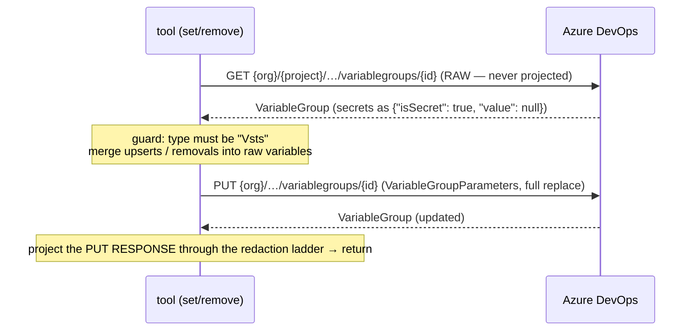

# Design: Variable group write tools

- Status: Implemented, live-verified 2026-08-26 · Date: 2026-08-26 · Related: GitHub issue #38, `src/devops_mcp/tools/variable_groups.py`, `src/devops_mcp/redaction.py`

> **Live verification, 2026-08-26.** A run against a real Azure DevOps Services organization
> disproved several assumptions below. Every correction is marked **(live-verified 2026-08-26)**
> in place; the open questions at the foot are answered or marked unanswerable.

## Summary

Add four write tools to `tools/variable_groups.py`: `devops_set_variable_group_variables` and
`devops_create_variable_group` (gated on `AZDO_ALLOW_WRITE` via `@write_tool`),
`devops_remove_variable_group_variables` and `devops_delete_variable_group` (gated on
`AZDO_ALLOW_DELETE` via `@delete_tool`, because both destroy data). Azure DevOps has no
variable-level write API — the only update verb is a **full-replace PUT of the whole group** — so the
variable-level tools perform the read‑merge‑write themselves. The single dominating hazard is that
the merge must read the **raw, un-redacted** GET response; merging onto the redacted projection that
`devops_get_variable_group` returns would write redaction placeholders over live secrets. The design
makes that boundary structural (a separate raw fetch, an allowlisted body builder, and a shape
tripwire that raises if a projected dict ever reaches the merge).

## Context & problem

`distributedtask/variablegroups` is GA at `api-version=7.1` and already used read-only by this
module. The write surface has three properties that decide the whole design:

1. **PUT is a full replace.** `VariableGroupParameters` has no patch semantics. Anything not in the
   body is gone after the call — including other people's variables, the description, the type, and
   (critically) the *sharing list* `variableGroupProjectReferences`.
2. **The write routes are organization-scoped, the read route is project-scoped.** Verified against
   the 7.1 reference (see the route table). This is the opposite of what the rest of this module
   does and the easiest thing in the feature to get wrong.
3. **Secret values are unreadable.** GET returns `{"value": null, "isSecret": true}`, and this
   server additionally refuses to echo even that. A read‑merge‑write therefore has to re-send secrets
   it cannot see, and be provably right about it, or the tool is a secret-shredder.

## Goals / Non-goals

**Goals.** Variable-level intent (`set` / `remove` named variables) that never clobbers a variable
the caller did not name. Group create and group delete. A redaction boundary that a later refactor
cannot silently cross. Truthful annotations and gating.

**Non-goals.** Creating or editing Key Vault-backed groups. Changing a group's `type` or
`providerData`. Renaming a group or editing its description as a standalone operation (out of scope
for #38; `set` carries name/description through unchanged). Sharing a group into another project or
un-sharing it. Any optimistic-concurrency scheme the API does not offer.

## Proposed design

### 1. Routes — verified against the 7.1 reference

| Operation | Method + path | Required query | Scope |
|---|---|---|---|
| Get (pre-read) | `GET https://dev.azure.com/{org}/{project}/_apis/distributedtask/variablegroups/{groupId}` | `api-version=7.1` | **project** |
| Update | `PUT https://dev.azure.com/{org}/_apis/distributedtask/variablegroups/{groupId}` | `api-version=7.1` | **organization** |
| Add | `POST https://dev.azure.com/{org}/_apis/distributedtask/variablegroups` | `api-version=7.1` | **organization** |
| Delete | `DELETE https://dev.azure.com/{org}/_apis/distributedtask/variablegroups/{groupId}` | `api-version=7.1`, **`projectIds`** | **organization** |

Consequences for the repo's helpers:

- `build_org_url(organization, path)` (`client.py:207`) already builds the project-less form. **No
  new URL builder is needed** — use `build_url()` for the pre-read only and `build_org_url()` for
  PUT/POST/DELETE.
- `resolve_project()` is still called by all four tools, but for these three routes the project is a
  **payload/scope value, not a path segment**: it selects the pre-read, supplies
  `variableGroupProjectReferences`, and supplies `projectIds`. Every tool still errors with the
  repo's standard message when no project can be resolved.
- `build_params()` hard-codes `api-version=7.1`, which is correct for all four routes — use it.
- `projectIds` is an **array parameter, comma-joined into one value** (`?projectIds=guid1,guid2`).
  Passing a Python list to httpx would emit repeated `projectIds=` keys and is wrong; join with
  `","` before the call.
- `request_with_retry` already treats PUT/DELETE as idempotent (retried on 502/503/504) and POST as
  not (429 only). That is the behaviour we want — a retried create would duplicate a group. No
  change to `client.py`.

### 2. The read‑merge‑write

There must be **no `await` between the GET and the PUT other than the PUT itself** — that window is
the lost-update race (§6), so keep it as short as the code allows.

**Body construction is an allowlist, not a copy.** `VariableGroupParameters` has exactly six
properties; build the PUT body by projecting the raw GET onto those six keys and nothing else. This
mirrors redaction Rule 1 (allowlist, never denylist) and means an unknown future GET field can never
leak into a write body.

| Raw GET field | In `VariableGroupParameters`? | PUT body |
|---|---|---|
| `name` | yes | carried verbatim from the raw GET |
| `description` | yes | carried verbatim; key omitted if the GET omitted it |
| `type` | yes | carried verbatim (will always be `"Vsts"` — see §5) |
| `providerData` | yes | carried verbatim, including undocumented keys, when present |
| `variableGroupProjectReferences` | yes | carried verbatim when non-empty; **synthesized when absent** (below) |
| `variables` | yes | the merge result |
| `id` | no | **dropped** — it addresses the resource in the URL |
| `createdBy`, `createdOn`, `modifiedBy`, `modifiedOn` | no | **dropped** — server-owned |
| `isShared` | no | **dropped** — derived server-side from the reference list |
| anything else | no | **dropped** |

**`variableGroupProjectReferences` is effectively required on the org-scoped PUT and POST.** With no
project in the path, it is the only thing that tells the service which project(s) own the group;
omitting it answers HTTP 400 `Atleast one variable group project reference is required` (sic). Two
rules follow:

- **Carry the whole array through unchanged.** A full replace replaces the sharing list too —
  dropping references un-shares the group from every other project. Never rebuild the array from the
  resolved project when the GET supplied one.
- **Synthesize only when the GET returned no references at all** — which, **(live-verified
  2026-08-26)**, never happens on Azure DevOps Services: the project-scoped GET *always* returns
  `variableGroupProjectReferences`, so the synthesis branch in `set`/`remove` is dead code live and
  is exercised only by the stub tests. Keep it (the 7.1 Get sample does not show the field, and
  on-prem may differ), but do not treat it as a supported path. When it does run: resolve the
  project's GUID with
  `GET {org}/_apis/projects/{project}?api-version=7.1` and send a single reference
  `{"projectReference": {"id": <guid>, "name": <project name>}, "name": <group name>, "description": <group description>}`.
  `projectReference.id` must be a **GUID**; a project name there is not reliable.

### 3. THE CRITICAL HAZARD — the redaction boundary

`devops_get_variable_group` returns a projected view in which every secret's value is *gone*
(`value_available: false`) and every name-heuristic hit is `value: null, redacted: "name_heuristic"`.
Merging onto that view and PUTting it would write nulls/absences over live secrets **and** over
plain values whose names merely looked secret. This is the failure this design exists to prevent.

Four structural defences, all required:

1. **A separate raw fetch.** `_fetch_group_raw(app_ctx, organization, project, group_id) -> dict`
   returns the un-redacted GET body and is the *only* caller of the project-scoped GET inside the
   write paths. Its docstring states the invariant in the imperative: *this dict is un-redacted;
   it must never be returned to the model, never passed to `finalize_response`, and exists solely to
   build a PUT body.* It is plainly not the tool path — no `@mcp.tool`, no `Context` argument.
2. **The projection is extracted and reused, not re-implemented.** Factor the body of
   `devops_get_variable_group` into a pure `_project_group(data: dict, include_values: bool) -> dict`
   (it already has `_project_variable`, `_project_provider_data`, `_project_group_references` to lean
   on). Every tool that returns a group — get, set, remove, create — returns
   `_project_group(...)` of a **server response**, never of a body the tool constructed.
3. **A shape tripwire in the merge.** The pure body builder (`_build_update_body(raw_group, …)`)
   asserts the API casing it expects and raises `ValueError` the moment it sees a projected key
   (`is_secret`, `value_available`, `redacted`, `is_readonly`) inside `variables`. Six lines; it
   converts the catastrophic silent failure into a loud one. A unit test asserts the tripwire fires
   when a `_project_group` output is fed to it.
4. **Direction-of-flow rule, stated in the module docstring.** Raw flows *in* to the merge; projected
   flows *out* to the model. The two never meet.

**Round-tripping a secret the caller is not touching.** Copy the entry through as
`{"isSecret": true}` (plus `"isReadOnly": true` if present) and **omit the `value` key entirely**.
Do not send `value: null`. Rationale: the Azure CLI's `az pipelines variable-group variable *`
commands do exactly this read‑merge‑write, and the msrest serializer they sit on omits `None`
attributes — so the mainstream, heavily-exercised path on this API sends secrets back with no
`value` key and existing values survive. The 7.1 reference documents nothing either way, and what
the service does with an explicit `value: null` is **unverified** — it could plausibly be read as
"set to empty". Omitting the key is safe under either reading, so omit it always. Same rule for a
secret the caller *is* touching but only to change a flag: no value key means no value change.

### 4. Merge rules

- **Name matching is case-insensitive**, and an upsert of an existing variable **preserves the
  stored key's casing**. Pipeline variable names are case-insensitive at consumption; creating both
  `Foo` and `foo` in one group would be an unfixable mess from an LLM's point of view. If a name
  matches two existing keys ambiguously (a group authored outside this server), refuse the whole
  call and name the collision.
- **`set` with a value creates or replaces** that variable and leaves every other entry byte-identical
  to what the GET returned.
- **`set` with `is_secret: true` and a value sets a secret** — that is the supported way to write one.
- **`set` with an empty-string value on a variable that stays secret is refused
  (live-verified 2026-08-26).** Azure DevOps ignores it — HTTP 200, echoed back as
  `{"value": null, "isSecret": true}`, old value retained — so accepting it would report a write that
  did not happen. Two arms are needed, because the secret flag has two sources: the input model
  refuses an explicit `is_secret: true` + `""` (no HTTP at all, and it covers `create` too), and
  `_merge_variables` refuses `""` on a variable whose *stored* entry is secret and whose `is_secret`
  is left to inherit. `_new_variables` repeats the check at its own seam, the way it already does for
  a missing `value`.
  An empty value on a plain variable is a real write and stays supported; so does a demotion
  (`is_secret: false`) to an empty plaintext value. The message points at
  `devops_remove_variable_group_variables` for a caller who meant to get rid of the variable.
- **`set` that would demote a secret to plain (`is_secret: false`) without supplying a value is
  refused** as an input error: the current value cannot be read back, so the merged entry would be a
  valueless plain variable — silent secret destruction. The message tells the caller to pass `value`
  in the same call. Promotion (plain → secret, no value supplied) is allowed and encrypts the
  existing value.
- **`remove` is all-or-nothing.** If any requested name is absent, nothing is written and the error
  lists the missing names (plus the group's actual variable names, capped). `ignore_missing: true`
  downgrades that to "skip the absent ones", which makes a retried removal idempotent. If every
  requested name is absent under `ignore_missing`, return success with `removed: []` and issue no
  PUT at all.
- Removing the group's last variable is passed through to the service, and the service **refuses
  it** — HTTP 400 `ArgumentException: "Variable group must have at least one variable defined."`
  **(live-verified 2026-08-26)**. The removal does not apply, so the mapped message says nothing was
  removed and points at `devops_delete_variable_group` for a caller who meant to get rid of the group
  itself. The `typeKey` is the generic `ArgumentException`, so the message text is the only
  distinguishing signal — this is the one arm that matches on prose rather than a code.

### 5. Key Vault-backed groups — refuse

`devops_set_variable_group_variables` and `devops_remove_variable_group_variables` **refuse any group
whose `type` is not `"Vsts"`** (case-insensitive compare on the raw GET's `type`), before any PUT is
issued. The error names the observed type and points at the Library UI / the vault.

Justification. A `type: "AzureKeyVault"` group's variables are *references* to vault secrets, always
`{"value": null, "isSecret": true}`, carrying undocumented `enabled`/`contentType` keys, alongside a
`providerData` `{serviceEndpointId, vault}` whose schema Microsoft documents as an object with no
properties. Upserting a plain value there is meaningless at best. Worse, a full-replace PUT built
from a shape we cannot verify risks dropping `enabled`/`contentType` for *every* remaining reference
or breaking the vault linkage — a large blast radius for a capability nobody asked for. An unknown
future type gets the same refusal for the same reason: this is the allowlist rule again, and a
denylist would fail open on the first type that ships. `devops_create_variable_group` sends
`"type": "Vsts"` unconditionally; type is not a caller-settable field.

`devops_delete_variable_group` does **not** apply the type guard — deleting a KV-backed group is a
legitimate delete and does not touch the vault.

### 6. Concurrency — none exists; the window is documented

`VariableGroup` carries **no `rev`, no ETag, and the PUT accepts no `If-Match`**. There is nothing to
mitigate with. Last writer wins, and the read‑merge‑write has a genuine lost-update window: a
variable another actor adds between our GET and our PUT is silently erased.

Decision: document it, do not engineer around it. Concretely — the tool docstrings say so in one
sentence; the responses carry `modified_on` so a caller can spot an unexpected change; the GET→PUT
window contains no other awaits. An `expected_modified_on` precondition was considered and rejected:
the check would run client-side *inside* the same race it claims to close, so it would buy confidence
without buying safety. Residual risk accepted: concurrent edits to the same variable group are rare
in practice, and the alternative (no write tools) is worse.

### 7. Delete semantics

**Deletion is permanent.** Library items have no recycle bin, no soft delete, and no restore path —
unlike this repo's saved queries, and unlike work items. A deleted variable group and its secrets are
unrecoverable except from an external backup. Annotations, docstring and the success payload must all
say exactly that; do not copy the "recoverable" phrasing from `devops_delete_query`.

**`projectIds` selects which project(s) the group is deleted from.** On the org-scoped route it is
the required scope parameter; passing every project that references the group removes the group
entirely. Behaviour when a *subset* is passed for a shared group — reference removed, group survives
elsewhere — follows from the route shape but is **not documented and cannot be verified on Azure
DevOps Services at all**, because a shared group cannot be created there (O1).

The DELETE answers a **bodiless HTTP 204** **(live-verified 2026-08-26)**, not the `200 OK` the
reference documents. Nothing is read back from it either way — accept any 2xx.

Tool behaviour, chosen to be the least destructive reading of an ambiguous API:

- Pre-read the group (raw GET, project-scoped) to obtain `variableGroupProjectReferences`. This also
  turns "unknown group" into a clean 404 message before anything is deleted.
- Default: send **only the resolved project's GUID**. `all_projects: true` sends every GUID in the
  reference list.
- If the pre-read returns no references, fall back to resolving the project GUID via
  `{org}/_apis/projects/{project}`.
- The response reports `deleted: true`, `recoverable: false`, `projects_deleted_from`, and
  `remaining_project_references` (the pre-read list minus what was sent) so the caller can tell
  "gone" from "un-shared here". When `remaining_project_references` is empty, the payload says the
  group no longer exists anywhere.

### 8. Input models (`models.py`, in the existing variable-group section)

A shared nested model, `extra="forbid"` like every model here:

**`VariableGroupVariableInput`** (plain `BaseModel`, not `AzDoBaseInput`)

| Field | Type | Required | Notes |
|---|---|---|---|
| `name` | `str` | yes | `min_length=1`; rejected if blank after strip |
| `value` | `str \| None` | no (default `None`) | `None` = leave the existing value unchanged (variable must already exist); `""` = set an empty value **on a plain variable only** — an empty value on a secret is ignored by the service (R1), so it is refused here. Explicit JSON `null` and omission are treated identically — say so in the description rather than pretending to distinguish them |
| `is_secret` | `bool \| None` | no (default `None`) | `None` = inherit the existing flag; `False` for a new variable |
| `is_readonly` | `bool \| None` | no (default `None`) | same inheritance rule |

**`SetVariableGroupVariablesInput(AzDoBaseInput)`** — `group_id: int (ge=1)`,
`variables: list[VariableGroupVariableInput]` (`min_length=1`). A field validator rejects duplicate
names within the list (case-insensitively) so the payload has one intent per variable.

**`RemoveVariableGroupVariablesInput(AzDoBaseInput)`** — `group_id: int (ge=1)`,
`names: list[str]` (`min_length=1`, each non-blank, de-duplicated case-insensitively),
`ignore_missing: bool = False`.

**`CreateVariableGroupInput(AzDoBaseInput)`** — `name: str` (`min_length=1`),
`description: str | None = None`, `variables: list[VariableGroupVariableInput]` (`min_length=1`).
On create, an entry with `value is None` is an input error — there is no existing value to inherit.
No `type` field: creation is always `Vsts`.

**`DeleteVariableGroupInput(AzDoBaseInput)`** — `group_id: int (ge=1)`,
`all_projects: bool = False`.

### 9. Annotations

| Tool | Gate | `readOnlyHint` | `destructiveHint` | `idempotentHint` | `openWorldHint` |
|---|---|---|---|---|---|
| `devops_set_variable_group_variables` | `@write_tool` | false | **false** | **true** | true |
| `devops_remove_variable_group_variables` | `@delete_tool` | false | **true** | **true** | true |
| `devops_create_variable_group` | `@write_tool` | false | false | **false** | true |
| `devops_delete_variable_group` | `@delete_tool` | false | **true** | **true** | true |

Reasoning, since these must be truthful: `set` overwrites the named variables but destroys nothing
the caller did not name, and re-sending the identical call converges to the same state — non-destructive,
idempotent. `remove` and the group delete destroy data (irrecoverably, for the group delete), yet
repeating either lands on the same end state — destructive **and** idempotent; the two hints are
orthogonal. A repeat is not a silent no-op — a second `delete` fails its pre-read and returns an
error **(live-verified 2026-08-26)** — but `idempotentHint` claims no *additional effect*, not a
successful repeat, and this is exactly how `devops_delete_work_item` and `devops_delete_query`
already declare themselves. `create` is not idempotent: a second call makes a second group (or 409s
on the duplicate name). All four are open-world.

### 10. Response shape

Every group-returning tool returns `_project_group(<server response>, include_values=False)` — the
**same redacted shape as `devops_get_variable_group`**, so a caller can confirm names, `is_secret`,
`is_readonly`, `variable_count` and `secret_variable_count` in one step without a second call. Values
are omitted deliberately: the caller supplied them, and echoing them back would re-expose a plaintext
value the redaction ladder exists to withhold. The docstring points at `devops_get_variable_group`
for values.

Each write tool adds a small per-call summary alongside the group projection:

- `set` — `variables_added: [names]`, `variables_updated: [names]`
- `remove` — `removed: [names]`, `skipped_missing: [names]` (only under `ignore_missing`)
- `create` — nothing extra; the projection carries the new `id`
- `delete` — no group projection (there is nothing to read back): `group_id`, `deleted: true`,
  `recoverable: false`, `projects_deleted_from`, `remaining_project_references`, and a `note` that
  the delete is permanent

The HTML-sign-in-page check that both read tools already perform applies to every request these
tools issue, pre-read and write alike.

### 11. Error handling

Per the repo contract: `httpx.HTTPStatusError` caught before `Exception`, nothing uncaught escapes,
every error is `{"error": true, "message": …}` through `finalize_response`. A shared
`_write_error_message(status, msg, *, subject, project, organization)` maps:

| Condition | Message |
|---|---|
| 401 | Re-auth; **writes need `vso.variablegroups_manage`**, not the read scope |
| 403 | The identity needs the **Administrator** role on the group (Pipelines → Library → group → Security) in the named project — Reader is enough to read and not to write |
| 404 on the pre-read | Group not found in the project, or owned by another project and not shared into it (reuse the existing `_get_error_message` wording). **Never fires on Azure DevOps Services (live-verified 2026-08-26)** — see below; kept for on-prem |
| 404 on PUT/POST/DELETE | Group id not found **in the organization** — note the different meaning; there is no project in this route |
| 400 containing `project reference` | Internal bug signal: the body reached the service without `variableGroupProjectReferences`. Say so plainly rather than blaming the caller's input |
| `typeKey: VariableGroupExistsException` (create) | A group of that name already exists in the project. **The status is 409, not 400 (live-verified 2026-08-26)** — match on the typeKey, never on the status and never on the `already exists` prose (O2, answered) |
| 400 `Variable group must have at least one variable defined.` | The removal was refused and nothing changed — keep a variable, or delete the group with `devops_delete_variable_group` (O4, answered) |
| other 400 | Echo the service message with the group id and `api-version=7.1` |
| HTML content-type | Existing `_HTML_SIGNIN_MESSAGE` |

**An unknown group id, and a group id belonging to another project, both answer HTTP 200 with a body
of `null` — never 404 (live-verified 2026-08-26).** The `if not data:` guards in
`devops_get_variable_group` and `_fetch_group_raw` are therefore the *only* live producers of the
not-found message; the two 404 arms are on-prem insurance and are commented as such in the source so
a later reader does not mistake them for the live path.

Input-level refusals (raised as `ValueError`, caught by the existing handler) with actionable text:
Key Vault / non-`Vsts` group; secret demotion without a value; unknown names under `remove` without
`ignore_missing`; ambiguous case-colliding names; `value` omitted on create; unresolvable org/project.

## Alternatives considered

- **Expose a raw "replace whole group" tool and let the model do the merge.** Rejected: it hands an
  LLM a loaded full-replace PUT built from a *redacted* read — precisely the secret-destroying path
  this design is built to make impossible.
- **Merge onto `devops_get_variable_group`'s output** (reusing the existing projection). Rejected —
  it is the hazard, not a shortcut.
- **`expected_modified_on` optimistic-concurrency input.** Rejected; see §6.
- **Pass KV-backed groups through.** Rejected; see §5.
- **A new pure module (`variable_group_merge.py`) alongside `redaction.py`.** Rejected as
  over-engineering: only one module consumes the merge. The helpers stay module-private and pure in
  `variable_groups.py`, which keeps them directly unit-testable anyway.

## Affected areas & work split

Files: `src/devops_mcp/models.py` (variable-group section, ~`models.py:1764-1820`),
`src/devops_mcp/tools/variable_groups.py` (all four tools + helpers + module docstring),
`tests/test_variable_group_write.py` (new), `tests/test_variable_group_create_delete.py` (new),
`CHANGELOG.md` (new `1.9.0`), `README.md` (tool count `66`→`70` at `README.md:159`; the
`Variable groups (2)` table at `README.md:273-278`), `CLAUDE.md` (architecture line 35: `2 tools`→
`6 tools`; new Azure DevOps Conventions bullets for the org-scoped write routes, the comma-joined
`projectIds`, and the raw-vs-redacted merge invariant). No change to `client.py`, `_app.py`,
`redaction.py`, or `server.py`.

Three of the four tools live in one module, so parallel builders would collide. Recommended split is
**sequential, one builder, two passes**:

- **Pass 1 — developer.** `models.py` additions; module-private helpers in `variable_groups.py`
  (`_fetch_group_raw`, extracted `_project_group`, `_build_update_body` + tripwire, `_merge_variables`,
  `_resolve_project_id`, `_vsts_type_guard`, `_write_error_message`); the two variable-level tools;
  `tests/test_variable_group_write.py`. Boundary: does not touch create/delete or the docs.
- **Pass 2 — developer.** `devops_create_variable_group` and `devops_delete_variable_group` on top of
  pass 1's helpers; `tests/test_variable_group_create_delete.py` including the subprocess gate probes
  for **all four** tools; CHANGELOG / README / CLAUDE.md. Boundary: adds tools, does not rewrite
  pass 1's helpers.
- **Live verification (either pass, before merge).** Against a scratch project in a sandbox org —
  see the release gate under Risks.

## Testing

All tests use the repo's `httpx.AsyncBaseTransport` capturing-stub style (`tests/test_work_item_delete.py`,
`tests/test_service_connection_variable_group_redaction_e2e.py`), no network, no credentials.

**Secret-preservation and redaction boundary (the load-bearing set).**

1. Wire test: with a group holding a plaintext var, a secret var, and a name-heuristic var
   (`DB_PASSWORD` with a plaintext value), `set` on an unrelated name produces a PUT body in which
   the secret appears as exactly `{"isSecret": true}` — **`value` key absent**, no `null` — and the
   heuristic variable's **plaintext value is carried through verbatim** (redaction must not leak into
   the write).
2. The merge is not built from the redacted projection: feed `_project_group(...)` output to
   `_build_update_body` and assert the tripwire raises.
3. Planted-secret scan (mirroring the existing e2e test): the tool's returned JSON contains none of
   the planted values, while the captured PUT body contains the untouched ones.
4. Untouched variables are byte-identical between the GET response and the PUT body.
5. `set` with `is_secret: true` + a value sends `{"isSecret": true, "value": "<v>"}`.
6. Secret demotion without a value is refused and **no HTTP request is made** past the pre-read.

**Body construction.**

7. The PUT body contains exactly the six `VariableGroupParameters` keys — `id`, `createdBy`,
   `createdOn`, `modifiedBy`, `modifiedOn`, `isShared` are absent.
8. `variableGroupProjectReferences` from the GET (two projects) is carried through unchanged —
   asserting the sharing list is not narrowed to the resolved project.
9. When the GET omits the references, the tool calls `{org}/_apis/projects/{project}` and synthesizes
   a single reference carrying the project GUID.
10. Case-insensitive upsert onto `Foo` keeps the key `Foo` and does not create `foo`.

**Route/scope wire tests (one per verb).**

11. Pre-read GET URL contains `/{project}/_apis/`.
12. PUT URL is `https://dev.azure.com/{org}/_apis/distributedtask/variablegroups/{id}` — asserts the
    project segment is **absent** — with `api-version=7.1`.
13. POST URL has no `{groupId}` and no project segment; `Content-Type: application/json` present.
14. DELETE URL is org-scoped and carries `projectIds` as a **single comma-joined value** (assert the
    raw query string, so a repeated-key serialization fails the test); `all_projects=True` includes
    every reference GUID.

**Behaviour and errors.**

15. `remove` all-or-nothing: an unknown name refuses and issues no PUT; `ignore_missing=True` removes
    the known ones and reports `skipped_missing`; all-missing + `ignore_missing` issues no PUT and
    reports `removed: []`.
16. KV refusal: a `type: "AzureKeyVault"` pre-read refuses both `set` and `remove` before any PUT;
    an unknown type refuses the same way; `delete` is **not** refused for a KV group.
17. Delete response reports `recoverable: false` and correct `remaining_project_references` for both
    the sole-reference and shared-group cases.
18. Error mapping: 401, 403, 404-on-pre-read vs 404-on-write, **200-with-`null` pre-read** (the live
    "no such group" shape), 400 `project reference`, **409 `VariableGroupExistsException`** (asserted
    at 400 too, so the mapping cannot re-nest itself under a status), 400
    `must have at least one variable defined`, HTML sign-in body.
19. Create with a variable missing `value` is an input error.
20. Response shape: every group-returning tool's payload has the same keys as
    `devops_get_variable_group`'s and carries no `value` keys.

**Gate registration (subprocess, per `tests/test_work_item_delete.py:369-432`).** The
`AZDO_ALLOW_WRITE`/`AZDO_ALLOW_DELETE` constants are read once at import of `devops_mcp._app`, so a
`monkeypatch.setenv` test is meaningless — probe a child process:

21. Neither env var set → none of the four tools is registered, while `devops_get_variable_group`
    still is (proving the import worked).
22. `AZDO_ALLOW_WRITE=true` alone → `set` and `create` registered; `remove` and `delete` **not**.
23. `AZDO_ALLOW_DELETE=true` alone → `remove` and `delete` registered; `set` and `create` **not**.
24. Both true → all four registered, with the annotation tuples from §9 asserted exactly.

## Risks & open questions

- **R1 — secret destruction (severity: critical, likelihood: low with this design).** Every defence
  in §3 targets it. **Release gate: CLOSED — PASSED (live-verified 2026-08-26).** An untouched secret
  survives the read‑merge‑write **byte-identical**. The proof is a throwaway pipeline that consumed
  the group, resolved the secret at runtime and compared its **SHA-256 in-job** against the known
  planted value — not merely an observation that `isSecret` stayed `true`, which is what the earlier
  weak-positive amounted to. The tool's own wire body was captured alongside it: the untouched secret
  went back as exactly `{"isSecret": true}`, **no `value` key**. Confirmed **twice, across two
  independent merges**, and guarded by an end-to-end **negative control**: with the secret
  deliberately changed to a different value, the same pipeline **failed** with
  `SECRET_DIFFERENT_VALUE`, so the probe demonstrably detects a changed secret and a false pass was
  not available to it.

  Scope limits, stated plainly: **Azure DevOps Services only** (nothing was run against Server /
  on-prem); **one** untouched secret, not several; **no concurrent-modification case**; and nothing
  was established about a PUT carrying an explicit `"value": null`, since the tool never sends that
  shape — §3's "omit the key" rule remains the only verified one.

  The same run confirmed the hazard from two other sides, both of which are why client-side refusals
  exist here rather than trust in the service:
  - Demoting a secret to plaintext with `value` omitted **empties the variable silently** (HTTP 200,
    `{"value": null}` afterwards, no warning) — so the demotion refusal in `_merge_variables` is
    load-bearing, not defensive paranoia.
  - Setting a secret to an **empty string is silently ignored**: `{"isSecret": true, "value": ""}`
    answers **HTTP 200**, the service echoes back `{"value": null, "isSecret": true}`, and a pipeline
    run immediately afterwards still resolves the **old** value. So neither an omitted `value` nor an
    empty-string `value` can wipe a secret — the failure mode is a **false success report**, not data
    loss. Found by the R1 probe run; fixed by refusing an empty value on a secret at the input model
    (`VariableGroupVariableInput`) plus a merge-time arm for the inherited-flag case, rather than
    reporting an update that did not happen (§4, §8).
- **R2 — un-sharing by omission.** A full-replace PUT that drops `variableGroupProjectReferences`
  silently un-shares the group from other projects. Covered by test 8; keep that test. **Whether
  sharing survives a full replace is unanswerable on Azure DevOps Services (live-verified
  2026-08-26)** — see O1: no shared group can be built there to test it against. The carry-through
  rule stands on its own merits (a full replace replaces the array, whatever the array contains) and
  the stub test is the only guard that can exist.
- **R3 — lost update.** No concurrency control exists (§6). Accepted and documented.
- **R4 — permanent delete.** No recycle bin (§7). Mitigated only by the `AZDO_ALLOW_DELETE` gate and
  truthful annotations/messages.
- **O1 — `projectIds` subset semantics: UNANSWERABLE on Azure DevOps Services (live-verified
  2026-08-26).** Sharing a variable group is refused outright there — a create carrying two project
  references answers **HTTP 500 `"Sharing of variable group is not allowed."`**, and a PUT that adds
  a reference answers **HTTP 400 `"Variable group is not part of project {guid}."`** So a shared
  group cannot be constructed to test a subset delete against, and the question stays open unless it
  is retried on Azure DevOps Server. The tools' behaviour is already the safe reading: report which
  project ids were sent and which references were left, and assert nothing about the outcome.
- **O2 — ANSWERED (live-verified 2026-08-26).** The duplicate-name error is
  **HTTP 409 with `typeKey: VariableGroupExistsException`** (`eventId: 3000`). Keyed on the typeKey,
  per the repo's rule that codes beat statuses. The earlier message-substring match sat under a
  `status == 400` branch and was dead code.
- **O3 — ANSWERED (live-verified 2026-08-26).** The project-scoped GET *always* returns
  `variableGroupProjectReferences`, so the synthesis branch in §2 never runs live.
- **O4 — ANSWERED (live-verified 2026-08-26): no.** A group may not have zero variables. Removing
  the last one is refused with HTTP 400
  `ArgumentException: "Variable group must have at least one variable defined."` and nothing is
  changed; the tool maps it to actionable guidance (§4, §11).

## Doc-vs-source contradictions found

- **The brain note "Azure DevOps Service Endpoint and Variable Group REST APIs" describes
  `distributedtask/variablegroups` as project-scoped.** True for the read operations only. Update
  (PUT), Add (POST) and Delete (DELETE) are **organization-scoped** at 7.1, and Delete additionally
  requires `projectIds`. The note should be extended.
- **The task brief assumed GET and PUT are both project-scoped.** PUT is not.
- **The `VariableGroupParameters` reference marks no property as required**, yet omitting
  `variableGroupProjectReferences` on the org-scoped routes fails with HTTP 400
  `Atleast one variable group project reference is required`. Treat it as required.
- **Delete is documented as `200 OK` with no body type; it answers a bodiless `204`
  (live-verified 2026-08-26)** — exactly the saved-query pattern. Accept any 2xx and only parse JSON
  when there is content.
- **Create (POST) answers `200` with the full created group (live-verified 2026-08-26)**, so the
  bodiless-2xx fallback in `devops_create_variable_group` never fires in practice. It is kept —
  it costs nothing and preserves the "any 2xx is a success" rule the delete path really needs.
- **Nothing in the reference states what the PUT does with a secret's `value`** — neither that an
  omitted value preserves it nor that a null clears it. The design relies on prior art (the Azure CLI
  read‑merge‑write) plus the brain note, and requires live confirmation (R1).
